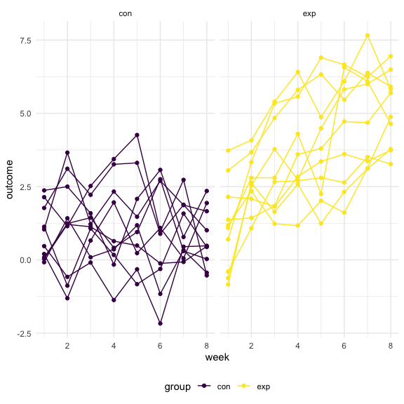
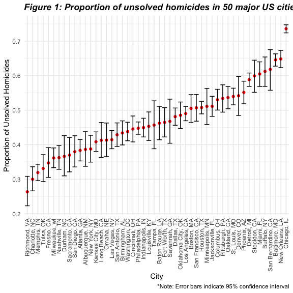
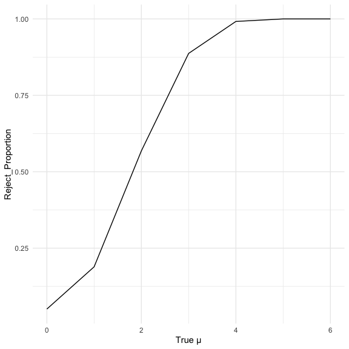
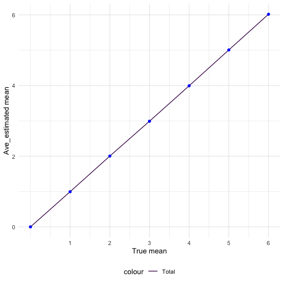
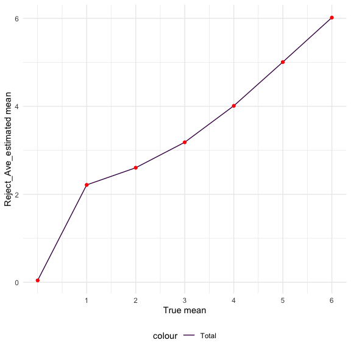

P8105_hw5_REN XIN
================
2022-11-16

\##Problem 1 Solution from Jeff

``` r
full_df = 
  tibble(
    files = list.files("data/zip_data/"),
    path = str_c("data/zip_data/", files)
  ) %>% 
  mutate(data = map(path, read_csv)) %>% 
  unnest()
```

    ## Rows: 1 Columns: 8
    ## ── Column specification ────────────────────────────────────────────────────────
    ## Delimiter: ","
    ## dbl (8): week_1, week_2, week_3, week_4, week_5, week_6, week_7, week_8
    ## 
    ## ℹ Use `spec()` to retrieve the full column specification for this data.
    ## ℹ Specify the column types or set `show_col_types = FALSE` to quiet this message.
    ## Rows: 1 Columns: 8
    ## ── Column specification ────────────────────────────────────────────────────────
    ## Delimiter: ","
    ## dbl (8): week_1, week_2, week_3, week_4, week_5, week_6, week_7, week_8
    ## 
    ## ℹ Use `spec()` to retrieve the full column specification for this data.
    ## ℹ Specify the column types or set `show_col_types = FALSE` to quiet this message.
    ## Rows: 1 Columns: 8
    ## ── Column specification ────────────────────────────────────────────────────────
    ## Delimiter: ","
    ## dbl (8): week_1, week_2, week_3, week_4, week_5, week_6, week_7, week_8
    ## 
    ## ℹ Use `spec()` to retrieve the full column specification for this data.
    ## ℹ Specify the column types or set `show_col_types = FALSE` to quiet this message.
    ## Rows: 1 Columns: 8
    ## ── Column specification ────────────────────────────────────────────────────────
    ## Delimiter: ","
    ## dbl (8): week_1, week_2, week_3, week_4, week_5, week_6, week_7, week_8
    ## 
    ## ℹ Use `spec()` to retrieve the full column specification for this data.
    ## ℹ Specify the column types or set `show_col_types = FALSE` to quiet this message.
    ## Rows: 1 Columns: 8
    ## ── Column specification ────────────────────────────────────────────────────────
    ## Delimiter: ","
    ## dbl (8): week_1, week_2, week_3, week_4, week_5, week_6, week_7, week_8
    ## 
    ## ℹ Use `spec()` to retrieve the full column specification for this data.
    ## ℹ Specify the column types or set `show_col_types = FALSE` to quiet this message.
    ## Rows: 1 Columns: 8
    ## ── Column specification ────────────────────────────────────────────────────────
    ## Delimiter: ","
    ## dbl (8): week_1, week_2, week_3, week_4, week_5, week_6, week_7, week_8
    ## 
    ## ℹ Use `spec()` to retrieve the full column specification for this data.
    ## ℹ Specify the column types or set `show_col_types = FALSE` to quiet this message.
    ## Rows: 1 Columns: 8
    ## ── Column specification ────────────────────────────────────────────────────────
    ## Delimiter: ","
    ## dbl (8): week_1, week_2, week_3, week_4, week_5, week_6, week_7, week_8
    ## 
    ## ℹ Use `spec()` to retrieve the full column specification for this data.
    ## ℹ Specify the column types or set `show_col_types = FALSE` to quiet this message.
    ## Rows: 1 Columns: 8
    ## ── Column specification ────────────────────────────────────────────────────────
    ## Delimiter: ","
    ## dbl (8): week_1, week_2, week_3, week_4, week_5, week_6, week_7, week_8
    ## 
    ## ℹ Use `spec()` to retrieve the full column specification for this data.
    ## ℹ Specify the column types or set `show_col_types = FALSE` to quiet this message.
    ## Rows: 1 Columns: 8
    ## ── Column specification ────────────────────────────────────────────────────────
    ## Delimiter: ","
    ## dbl (8): week_1, week_2, week_3, week_4, week_5, week_6, week_7, week_8
    ## 
    ## ℹ Use `spec()` to retrieve the full column specification for this data.
    ## ℹ Specify the column types or set `show_col_types = FALSE` to quiet this message.
    ## Rows: 1 Columns: 8
    ## ── Column specification ────────────────────────────────────────────────────────
    ## Delimiter: ","
    ## dbl (8): week_1, week_2, week_3, week_4, week_5, week_6, week_7, week_8
    ## 
    ## ℹ Use `spec()` to retrieve the full column specification for this data.
    ## ℹ Specify the column types or set `show_col_types = FALSE` to quiet this message.
    ## Rows: 1 Columns: 8
    ## ── Column specification ────────────────────────────────────────────────────────
    ## Delimiter: ","
    ## dbl (8): week_1, week_2, week_3, week_4, week_5, week_6, week_7, week_8
    ## 
    ## ℹ Use `spec()` to retrieve the full column specification for this data.
    ## ℹ Specify the column types or set `show_col_types = FALSE` to quiet this message.
    ## Rows: 1 Columns: 8
    ## ── Column specification ────────────────────────────────────────────────────────
    ## Delimiter: ","
    ## dbl (8): week_1, week_2, week_3, week_4, week_5, week_6, week_7, week_8
    ## 
    ## ℹ Use `spec()` to retrieve the full column specification for this data.
    ## ℹ Specify the column types or set `show_col_types = FALSE` to quiet this message.
    ## Rows: 1 Columns: 8
    ## ── Column specification ────────────────────────────────────────────────────────
    ## Delimiter: ","
    ## dbl (8): week_1, week_2, week_3, week_4, week_5, week_6, week_7, week_8
    ## 
    ## ℹ Use `spec()` to retrieve the full column specification for this data.
    ## ℹ Specify the column types or set `show_col_types = FALSE` to quiet this message.
    ## Rows: 1 Columns: 8
    ## ── Column specification ────────────────────────────────────────────────────────
    ## Delimiter: ","
    ## dbl (8): week_1, week_2, week_3, week_4, week_5, week_6, week_7, week_8
    ## 
    ## ℹ Use `spec()` to retrieve the full column specification for this data.
    ## ℹ Specify the column types or set `show_col_types = FALSE` to quiet this message.
    ## Rows: 1 Columns: 8
    ## ── Column specification ────────────────────────────────────────────────────────
    ## Delimiter: ","
    ## dbl (8): week_1, week_2, week_3, week_4, week_5, week_6, week_7, week_8
    ## 
    ## ℹ Use `spec()` to retrieve the full column specification for this data.
    ## ℹ Specify the column types or set `show_col_types = FALSE` to quiet this message.
    ## Rows: 1 Columns: 8
    ## ── Column specification ────────────────────────────────────────────────────────
    ## Delimiter: ","
    ## dbl (8): week_1, week_2, week_3, week_4, week_5, week_6, week_7, week_8
    ## 
    ## ℹ Use `spec()` to retrieve the full column specification for this data.
    ## ℹ Specify the column types or set `show_col_types = FALSE` to quiet this message.
    ## Rows: 1 Columns: 8
    ## ── Column specification ────────────────────────────────────────────────────────
    ## Delimiter: ","
    ## dbl (8): week_1, week_2, week_3, week_4, week_5, week_6, week_7, week_8
    ## 
    ## ℹ Use `spec()` to retrieve the full column specification for this data.
    ## ℹ Specify the column types or set `show_col_types = FALSE` to quiet this message.
    ## Rows: 1 Columns: 8
    ## ── Column specification ────────────────────────────────────────────────────────
    ## Delimiter: ","
    ## dbl (8): week_1, week_2, week_3, week_4, week_5, week_6, week_7, week_8
    ## 
    ## ℹ Use `spec()` to retrieve the full column specification for this data.
    ## ℹ Specify the column types or set `show_col_types = FALSE` to quiet this message.
    ## Rows: 1 Columns: 8
    ## ── Column specification ────────────────────────────────────────────────────────
    ## Delimiter: ","
    ## dbl (8): week_1, week_2, week_3, week_4, week_5, week_6, week_7, week_8
    ## 
    ## ℹ Use `spec()` to retrieve the full column specification for this data.
    ## ℹ Specify the column types or set `show_col_types = FALSE` to quiet this message.
    ## Rows: 1 Columns: 8
    ## ── Column specification ────────────────────────────────────────────────────────
    ## Delimiter: ","
    ## dbl (8): week_1, week_2, week_3, week_4, week_5, week_6, week_7, week_8
    ## 
    ## ℹ Use `spec()` to retrieve the full column specification for this data.
    ## ℹ Specify the column types or set `show_col_types = FALSE` to quiet this message.

The result of the previous code chunk isn’t tidy – data are wide rather
than long, and some important variables are included as parts of others.
The code chunk below tides the data using string manipulations on the
file, converting from wide to long, and selecting relevant variables.

``` r
tidy_df = 
  full_df %>% 
  mutate(
    files = str_replace(files, ".csv", ""),
    group = str_sub(files, 1, 3)) %>% 
  pivot_longer(
    week_1:week_8,
    names_to = "week",
    values_to = "outcome",
    names_prefix = "week_") %>% 
  mutate(week = as.numeric(week)) %>% 
  select(group, subj = files, week, outcome)
```

Finally, the code chunk below creates a plot showing individual data,
faceted by group.

``` r
tidy_df %>% 
  ggplot(aes(x = week, y = outcome, group = subj, color = group)) + 
  geom_point() + 
  geom_path() + 
  facet_grid(~group)
```



This plot suggests high within-subject correlation – subjects who start
above average end up above average, and those that start below average
end up below average. Subjects in the control group generally don’t
change over time, but those in the experiment group increase their
outcome in a roughly linear way.

\##Problem 2

1.Describe the raw data. Create a city_state variable (e.g. “Baltimore,
MD”) and then summarize within cities to obtain the total number of
homicides and the number of unsolved homicides (those for which the
disposition is “Closed without arrest” or “Open/No arrest”).

``` r
Homicide = read_csv("data/homicide-data.csv") 
```

    ## Rows: 52179 Columns: 12
    ## ── Column specification ────────────────────────────────────────────────────────
    ## Delimiter: ","
    ## chr (9): uid, victim_last, victim_first, victim_race, victim_age, victim_sex...
    ## dbl (3): reported_date, lat, lon
    ## 
    ## ℹ Use `spec()` to retrieve the full column specification for this data.
    ## ℹ Specify the column types or set `show_col_types = FALSE` to quiet this message.

There are total 52,179 entries and 12 columns in Homicide database.
Variables include `uid`, `reported_date`, `victim_last`, `victim_first`,
`victim_race`, `victim_age`, `victim_sex`, `city`, `state`, `lat`,`lon`,
and `disposition`.

\###Step1 Cleaning the data

``` r
Homicide_df = Homicide %>% 
  janitor::clean_names() %>% 
   mutate(
    victim_sex = as.factor(victim_sex),
    state = as.factor(state)
  ) %>% 
  unite('city_state',"city":"state", remove = FALSE)%>%
  mutate(
    city_state = 
      str_c(city, ", ", state),
    solved_or_not = case_when(
      disposition == "Closed without arrest" ~ "unsolved",
      disposition == "Open/No arrest" ~ "unsolved",
      disposition == "Closed by arrest" ~ "solved"
    )
  )%>% 
  filter (city_state != "Tulsa_AL")
```

\###Step2 summarize within cities to obtain the total number of
homicides and the number of unsolved homicides

``` r
cities_df = 
  Homicide_df %>% 
  select(city_state, disposition, solved_or_not) %>% 
  group_by(city_state) %>% 
  summarize(
    total_homicides = n(),
    unsolved_homicides = sum(solved_or_not == "unsolved"),
  percent_unsolved = round(unsolved_homicides*100 / total_homicides, 1)
  ) %>% 
  arrange(desc(total_homicides))
cities_df = cities_df[!rownames(cities_df) %in% c("51") , ]
cities_df %>%
  knitr::kable()
```

| city_state         | total_homicides | unsolved_homicides | percent_unsolved |
|:-------------------|----------------:|-------------------:|-----------------:|
| Chicago, IL        |            5535 |               4073 |             73.6 |
| Philadelphia, PA   |            3037 |               1360 |             44.8 |
| Houston, TX        |            2942 |               1493 |             50.7 |
| Baltimore, MD      |            2827 |               1825 |             64.6 |
| Detroit, MI        |            2519 |               1482 |             58.8 |
| Los Angeles, CA    |            2257 |               1106 |             49.0 |
| St. Louis, MO      |            1677 |                905 |             54.0 |
| Dallas, TX         |            1567 |                754 |             48.1 |
| Memphis, TN        |            1514 |                483 |             31.9 |
| New Orleans, LA    |            1434 |                930 |             64.9 |
| Las Vegas, NV      |            1381 |                572 |             41.4 |
| Washington, DC     |            1345 |                589 |             43.8 |
| Indianapolis, IN   |            1322 |                594 |             44.9 |
| Kansas City, MO    |            1190 |                486 |             40.8 |
| Jacksonville, FL   |            1168 |                597 |             51.1 |
| Milwaukee, wI      |            1115 |                403 |             36.1 |
| Columbus, OH       |            1084 |                575 |             53.0 |
| Atlanta, GA        |             973 |                373 |             38.3 |
| Oakland, CA        |             947 |                508 |             53.6 |
| Phoenix, AZ        |             914 |                504 |             55.1 |
| San Antonio, TX    |             833 |                357 |             42.9 |
| Birmingham, AL     |             800 |                347 |             43.4 |
| Nashville, TN      |             767 |                278 |             36.2 |
| Miami, FL          |             744 |                450 |             60.5 |
| Cincinnati, OH     |             694 |                309 |             44.5 |
| Charlotte, NC      |             687 |                206 |             30.0 |
| Oklahoma City, OK  |             672 |                326 |             48.5 |
| San Francisco, CA  |             663 |                336 |             50.7 |
| Pittsburgh, PA     |             631 |                337 |             53.4 |
| New York, NY       |             627 |                243 |             38.8 |
| Boston, MA         |             614 |                310 |             50.5 |
| Tulsa, OK          |             583 |                193 |             33.1 |
| Louisville, KY     |             576 |                261 |             45.3 |
| Fort Worth, TX     |             549 |                255 |             46.4 |
| Buffalo, NY        |             521 |                319 |             61.2 |
| Fresno, CA         |             487 |                169 |             34.7 |
| San Diego, CA      |             461 |                175 |             38.0 |
| Stockton, CA       |             444 |                266 |             59.9 |
| Richmond, VA       |             429 |                113 |             26.3 |
| Baton Rouge, LA    |             424 |                196 |             46.2 |
| Omaha, NE          |             409 |                169 |             41.3 |
| Albuquerque, NM    |             378 |                146 |             38.6 |
| Long Beach, CA     |             378 |                156 |             41.3 |
| Sacramento, CA     |             376 |                139 |             37.0 |
| Minneapolis, MN    |             366 |                187 |             51.1 |
| Denver, CO         |             312 |                169 |             54.2 |
| Durham, NC         |             276 |                101 |             36.6 |
| San Bernardino, CA |             275 |                170 |             61.8 |
| Savannah, GA       |             246 |                115 |             46.7 |
| Tampa, FL          |             208 |                 95 |             45.7 |

Description：When processing the data we found an error in the name of
the city and state of Tulsa, so I removed this data. The table shows
that Chicago has the highest number of homicides, it reached 5535, and
also has the highest unresolved rate (73.6%), followed by Philadelphia.

\###Step3 For the city of Baltimore, MD, use the prop. test & pull the
estimated proportion and confidence intervals

``` r
Baltimore_df =
  Homicide_df %>% 
  filter(Homicide_df$city_state == "Baltimore, MD")
Baltimore_df
```

    ## # A tibble: 2,827 × 14
    ##    uid       repor…¹ victi…² victi…³ victi…⁴ victi…⁵ victi…⁶ city_…⁷ city  state
    ##    <chr>       <dbl> <chr>   <chr>   <chr>   <chr>   <fct>   <chr>   <chr> <fct>
    ##  1 Bal-0016…  2.01e7 NELSON  LEON    Black   17      Male    Baltim… Balt… MD   
    ##  2 Bal-0016…  2.01e7 GOLF    EDDIE   Black   26      Male    Baltim… Balt… MD   
    ##  3 Bal-0016…  2.01e7 MACKEN… THOMAS… Black   21      Male    Baltim… Balt… MD   
    ##  4 Bal-0016…  2.01e7 CANUPP  EDWARD… White   61      Male    Baltim… Balt… MD   
    ##  5 Bal-0016…  2.01e7 CUNNIN… MICHAEL Black   46      Male    Baltim… Balt… MD   
    ##  6 Bal-0016…  2.01e7 ALSTON  RAY WI… Black   27      Male    Baltim… Balt… MD   
    ##  7 Bal-0016…  2.01e7 HENDER… YULE A… Black   21      Male    Baltim… Balt… MD   
    ##  8 Bal-0016…  2.01e7 MCDOWE… MARCU   Black   16      Male    Baltim… Balt… MD   
    ##  9 Bal-0016…  2.01e7 GARDNER RODNEY… Black   21      Male    Baltim… Balt… MD   
    ## 10 Bal-0016…  2.01e7 BURNET… NELSENE Black   44      Female  Baltim… Balt… MD   
    ## # … with 2,817 more rows, 4 more variables: lat <dbl>, lon <dbl>,
    ## #   disposition <chr>, solved_or_not <chr>, and abbreviated variable names
    ## #   ¹​reported_date, ²​victim_last, ³​victim_first, ⁴​victim_race, ⁵​victim_age,
    ## #   ⁶​victim_sex, ⁷​city_state

``` r
Baltimore_summary = 
  Homicide_df %>% 
  summarize( unsolved = sum( solved_or_not  == "unsolved"),n = n())
Baltimore_summary
```

    ## # A tibble: 1 × 2
    ##   unsolved     n
    ##      <int> <int>
    ## 1    26505 52179

``` r
Baltimore_test = 
  prop.test(
   x = Baltimore_summary %>% pull(unsolved),
   n=  Baltimore_summary %>%pull(n))
 
Baltimore_test %>% 
  broom::tidy() %>%  
  knitr::kable()
```

| estimate | statistic |   p.value | parameter |  conf.low | conf.high | method                                               | alternative |
|---------:|----------:|----------:|----------:|----------:|----------:|:-----------------------------------------------------|:------------|
| 0.507963 |  13.20263 | 0.0002796 |         1 | 0.5036634 | 0.5122614 | 1-sample proportions test with continuity correction | two.sided   |

\###Step4 run prop. test for each of the cities in this dataset

``` r
results_df = 
  cities_df %>% 
  mutate(test_results = map2(.x = unsolved_homicides, .y = total_homicides, ~prop.test(x = .x, n = .y)),
         tidy_results = map(test_results, broom::tidy)) %>% 
  select(-test_results) %>% 
  unnest(tidy_results) %>% 
  select(city_state, estimate, starts_with("conf"))
results_df
```

    ## # A tibble: 50 × 4
    ##    city_state       estimate conf.low conf.high
    ##    <chr>               <dbl>    <dbl>     <dbl>
    ##  1 Chicago, IL         0.736    0.724     0.747
    ##  2 Philadelphia, PA    0.448    0.430     0.466
    ##  3 Houston, TX         0.507    0.489     0.526
    ##  4 Baltimore, MD       0.646    0.628     0.663
    ##  5 Detroit, MI         0.588    0.569     0.608
    ##  6 Los Angeles, CA     0.490    0.469     0.511
    ##  7 St. Louis, MO       0.540    0.515     0.564
    ##  8 Dallas, TX          0.481    0.456     0.506
    ##  9 Memphis, TN         0.319    0.296     0.343
    ## 10 New Orleans, LA     0.649    0.623     0.673
    ## # … with 40 more rows

``` r
results_df %>% 
  mutate(city_state = fct_reorder(city_state, estimate)) %>% 
  ggplot(aes(x = city_state, y = estimate)) + 
  geom_point(color = "red") + 
  geom_errorbar(aes(ymin = conf.low, ymax = conf.high)) + 
  theme(axis.text.x = element_text(angle = 90, vjust = 0.5, hjust = 1),
        plot.title = element_text(face = "bold.italic" )) +
  labs(title = "Figure 1: Proportion of unsolved homicides in 50 major US cities", 
       y = "Proportion of Unsolved Homicides", 
       x = "City", 
       caption = "*Note: Error bars indicate 95% confidence interval")
```


Description：According to the data in the graph, the probability of
unsolved homicide varies greatly among the 50 major cities in the U.S.
For example, the highest is Chicago, which even reached 73.6%, followed
by New Orleans, LA with 64.9%. Richmond, VA, meanwhile, has the lowest
unsolved homicide rate, at 26.3%.

\###Problem 3

``` r
set.seed(1)
```

\###Step1 Creat a function

``` r
simtest = function(mu, sigma = 5, n = 30){
  x = rnorm(n = n, mean = mu, sd = sigma)
  a=x
  a
  result = t.test(x,mu = 0) %>%
    broom::tidy()%>%
    select(estimate,p.value)
  return(result)
}
u_iteration = 
  expand_grid(
    mu = seq(0,6,1),
    iterate = 1:5000) 
sim_results_df =
  u_iteration%>% 
  mutate(test_coef = map(mu, simtest)
  ) %>% 
  unnest(test_coef)

sim_results_df
```

    ## # A tibble: 35,000 × 4
    ##       mu iterate estimate p.value
    ##    <dbl>   <int>    <dbl>   <dbl>
    ##  1     0       1    0.412  0.629 
    ##  2     0       2    0.664  0.368 
    ##  3     0       3    0.551  0.534 
    ##  4     0       4    0.567  0.487 
    ##  5     0       5   -1.65   0.0599
    ##  6     0       6    1.19   0.229 
    ##  7     0       7    0.334  0.738 
    ##  8     0       8   -1.19   0.209 
    ##  9     0       9    0.122  0.887 
    ## 10     0      10    0.684  0.472 
    ## # … with 34,990 more rows

\###Step2

``` r
sim_results_df %>%
  group_by(mu) %>%
  summarise(
    rej_r = sum(p.value<0.05)/n()
  ) %>%
  ggplot(aes(x = mu, y = rej_r)) +
  geom_line() +
  labs(
    x = "True μ",
      y = "Reject_Proportion",
  )
```



Make a plot showing the proportion of times the null was rejected (the
power of the test) on the y axis and the true value of μ on the x axis.
Describe the association between effect size and power.

Describe the relationship between effect size and power: we keep the
sample size constant and the power increases in a decreasing gradient as
the effect size increases

\###Step3

``` r
Total_estimates =
  sim_results_df %>% 
  group_by(mu) %>% 
  summarize(
    average_est_mean = mean(estimate)
  )

Rejected_estimates = 
  sim_results_df %>% 
  filter(p.value < 0.05) %>% 
  group_by(mu) %>% 
  summarize(
    average_est_mean = mean(estimate)
  )

plot1=Total_estimates %>% 
  ggplot(aes(x = mu, y = average_est_mean)) +
           geom_line(aes(color = "Total")) +
           geom_point(color = "blue") +
           labs(x = "True mean", y = "Ave_estimated mean" ) +
  scale_x_continuous(breaks = 1:6)
plot1
```



``` r
plot2=Rejected_estimates %>% 
  ggplot(aes(x = mu, y = average_est_mean)) +
           geom_line(aes(color = "Total")) +
           geom_point(color = "red") +
           labs(x = "True mean", y = "Reject_Ave_estimated mean" ) +
  scale_x_continuous(breaks = 1:6)
plot2
```



Make a plot showing the average estimate of μ̂ on the y axis and the true
value of μ on the x axis. Make a second plot (or overlay on the first)
the average estimate of μ̂ only in samples for which the null was
rejected on the y axis and the true value of μ on the x axis. Is the
sample average of μ̂ across tests for which the null is rejected
approximately equal to the true value of μ? Why or why not?

From the figure, we can see that at mu less than or equal to 4, we find
that the sample mean of mu that rejects the null is not equal to the
true value of the mean at less than or equal to 4. However, the two
curves are close to overlapping when the sample mean of mu with
rejection of null is greater than 4.
